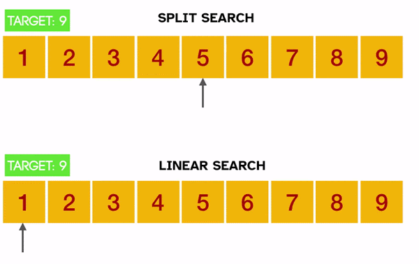

# 4.3 - Split Search

### Recursive Split Search Description

You can find [the explanation of split search here](https://www.brash.ca/ics4uc/4/3). It should be noted that the array being searched is _never_ modified or copied, only passed along to future calls.



You will be writing the `split_search()` function. You can find the skeleton for it inside [main.js](main.js). It requires 4 parameters (only two to start):
- `list` is the array of numbers or strings to search through (already sorted)
- `target` is the number or string to look for (might not be in the `list`)
- `low = 0` is the left-most index of the search window. This starts at zero (the first element in the array)
- `high = list.length-1` is the right-most index of the search window. This starts at the highest index (the last element in the array) 

### Part 1 - Pseudocode

It is important to plan. 

Utilizing either plain text, [Markdown](https://www.markdownguide.org/basic-syntax/), or a picture - create or upload  the file `pseudocode.txt` or `pseudocode.md` or `.png` or similar into this project (can be demonstrated in class if you need). Please name the file appropriately.

Within that file, have your **pseudo**code for the _recursive_ `split_search(list, target)` function. 

**Note:** Pseudocode is **_not_** actual code. No syntax is necessary, no need for brackets. It is English-based and should outline the logical process(es). There _are_ actual rules for true pseudocode but you can learn that in college/uni. [Here is a great YouTube video of a professor giving example algorithms all in pseudocode](https://youtu.be/sIxI0EcynPQ).

### Part 2 - Code
Write the `split_search(list, target)` function. This function utilizes [the Split Search algorithm described in class](https://www.brash.ca/ics4uc/4/3) to find and return the index (location) of the `target`. Note - `list` will be an _already sorted_ array of either integers or strings (but not a mixture of both). If strings, they will all be UPPERCASE or all lowercase. Because:
```JS
// JavaScript is aware of alphabetization!
"apple" < "zebra";  // This returns true

// However capitalization screws that up.
"A" == "a";  // False
```

**If the `target` is never found, return `-1`**

---

You will notice some arrays and functions within the code. They are documented - if you need assistance, just ask. When you are finished, test the code with several arrays - including Strings! If you are satisfied, submit your code and move on to [Merge Sort](https://www.brash.ca/ics4uc/4/4).

---

### Rubric
#### Simple Checklist Style Rubric:

|Below Level|Look-fors and descriptions|Level Achieved|
|---|---|---|
||The code is clean and easy-to read. It follows the formatting and spacing demonstrated in class, including proper tabbing, usage of which space, and brackets.||
||Any helper functions or larger sections of code you write are well-documented/commented. Comments are garammatically correct and easy to understand. They are also short enough to not be tedious to read but long enough to describe the situation.||
||The function is able to receive and utilize the given parameters `list` and `target`, _whithout modifying them_.||
||The function is written to solve the described situation within the given requirements. No pre-written libraries or outside code is utilized to make shortcuts or _cheat_. No unnecessary adjustments to the structure of running or testing the code. No renaming or rearranging function names or parameters.||
||The pseudocode is included and gives an easy-to-read description of the solution algorithm in an English-style manner. The pseudocode is _not_ code.||
||The `split_search()` function correctly retrieves the index of the `target` **or** correctly returns -1 if `target` is not found.||
||The `split_search()` function is coded in a _recursive_ manner, **not** an _iterative_ manner. No enumeration through the array is ever computed.||


<br><br><br><br><br><br><br><br>
